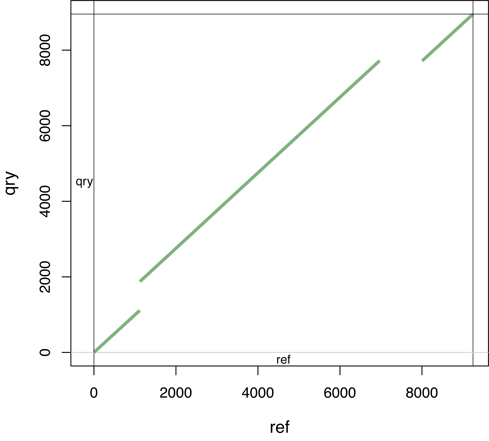

# ndotplot
Plot a dotplot using Nucmer alignments

### Requirements
The script was written with Perl and R is invoked. Both Perl and R are generally installed. If needed, please refer to [Perl](https://www.perl.org/) and [R](https://www.r-project.org/) for installation guides. 

The Nucmer module in software [Mummer](https://mummer.sourceforge.net/) is required.

### Installation of ndotplot
```
git clone git@github.com:liu3zhenlab/ndotplot.git
cd ndotplot
perl ndotplot
```

### Data requirements
Two sequence fasta files to be compared are required. In each file, multiple sequences are allowed.

### Example run
```
perl ndotplot --query data/qry.fas --ref data/ref.fas --minaln 1000 --prefix out
```
A editable PDF output was produced in the *out* directory.  



### Bug report
Please report any bugs or suggestion on github or by email to Sanzhen Liu (liu3zhen@ksu.edu).

### License
ndotplot is distributed under MIT licence.
